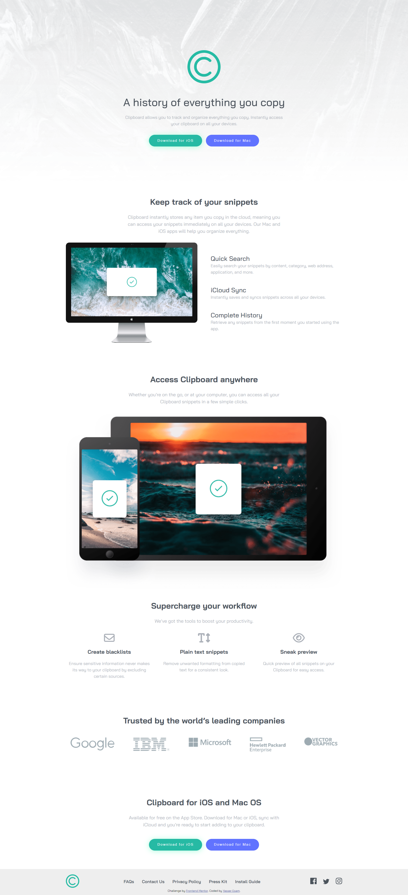

# Frontend Mentor - Clipboard landing page solution

## Table of contents

- [Overview](#overview)
  - [Links](#links)
  - [The challenge](#the-challenge)
  - [Screenshot](#screenshot)
- [My process](#my-process)
  - [Built with](#built-with)
- [Acknowledgments](#acknowledgments)

## Overview

### Links
- Live Site URL: [Add live site URL here](https://your-live-site-url.com)
- Solution URL: [Add solution URL here](https://your-solution-url.com)

### The challenge

Users should be able to:

- View the optimal layout for the site depending on their device's screen size
- See hover states for all interactive elements on the page

### Screenshot

## My process

### Built with

- Semantic HTML5 markup
- CSS custom properties
- Flexbox
- CSS Grid
- Mobile-first workflow

## Acknowledgments

This project was a great learning experience. Special thanks to Frontend Mentor for the challenge.
